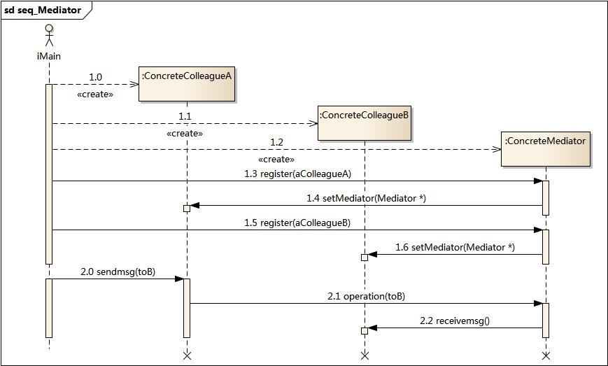
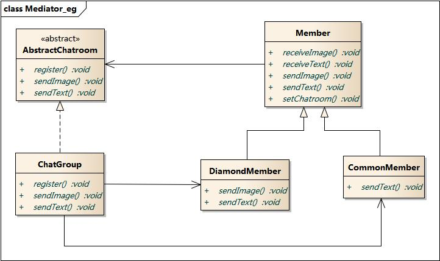

#中介者模式

#模式動機
- 在用戶與用戶直接聊天的設計方案中，用戶對象之間存在很強的關聯性，將導致系統出現如下問題：
- 系統結構複雜：對象之間存在大量的相互關聯和調用，若有一個對象發生變化，則需要跟蹤和該對象關聯的其他所有對象，並進行適當處理。
- 對象可重用性差：由於一個對象和其他對象具有很強的關聯，若沒有其他對象的支持，一個對象很難被另一個系統或模塊重用，這些對象表現出來更像一個不可分割的整體，職責較為混亂。
- 系統擴展性低：增加一個新的對象需要在原有相關對象上增加引用，增加新的引用關係也需要調整原有對象，系統耦合度很高，對象操作很不靈活，擴展性差。
- 在面向對象的軟件設計與開發過程中，根據“單一職責原則”，我們應該儘量將對象細化，使其只負責或呈現單一的職責。
- 對於一個模塊，可能由很多對象構成，而且這些對象之間可能存在相互的引用，為了減少對象兩兩之間複雜的引用關係，使之成為一個鬆耦合的系統，我們需要使用中介者模式，這就是中介者模式的模式動機。

#模式定義
中介者模式(Mediator Pattern)定義：用一箇中介對象來封裝一系列的對象交互，中介者使各對象不需要顯式地相互引用，從而使其耦合鬆散，而且可以獨立地改變它們之間的交互。中介者模式又稱為調停者模式，它是一種對象行為型模式。

#模式結構
中介者模式包含如下角色：

- Mediator: 抽象中介者
- ConcreteMediator: 具體中介者
- Colleague: 抽象同事類
- ConcreteColleague: 具體同事類

#時序圖

#代碼分析
--------------------

   :language: cpp
   :linenos:
   :lines: 1-
   :emphasize-lines: 10-19

   :language: cpp
   :linenos:
   :lines: 1-
   :emphasize-lines: 23-26

   :language: cpp
   :linenos:
   :lines: 1-
   :emphasize-lines: 21-42

   :language: cpp
   :linenos:
   :lines: 1-
   :emphasize-lines: 20-21

   :language: cpp
   :linenos:
   :lines: 1-
   :emphasize-lines: 18-25

#運行結果：

#模式分析
中介者模式可以使對象之間的關係數量急劇減少。

中介者承擔兩方面的職責：

- 中轉作用（結構性）：通過中介者提供的中轉作用，各個同事對象就不再需要顯式引用其他同事，當需要和其他同事進行通信時，通過中介者即可。該中轉作用屬於中介者在結構上的支持。
- 協調作用（行為性）：中介者可以更進一步的對同事之間的關係進行封裝，同事可以一致地和中介者進行交互，而不需要指明中介者需要具體怎麼做，中介者根據封裝在自身內部的協調邏輯，對同事的請求進行進一步處理，將同事成員之間的關係行為進行分離和封裝。該協調作用屬於中介者在行為上的支持。

時序圖

#實例
實例：虛擬聊天室

某論壇系統欲增加一個虛擬聊天室，允許論壇會員通過該聊天室進行信息交流，普通會員(CommonMember)可以給其他會員發送文本信息，鑽石會員(DiamondMember)既可以給其他會員發送文本信息，還可以發送圖片信息。該聊天室可以對不雅字符進行過濾，如“日”等字符；還可以對發送的圖片大小進行控制。用中介者模式設計該虛擬聊天室。

#優點
中介者模式的優點

- 簡化了對象之間的交互。
- 將各同事解耦。
- 減少子類生成。
- 可以簡化各同事類的設計和實現。

#缺點
中介者模式的缺點

- 在具體中介者類中包含了同事之間的交互細節，可能會導致具體中介者類非常複雜，使得系統難以維護。

#適用環境
在以下情況下可以使用中介者模式：

- 系統中對象之間存在複雜的引用關係，產生的相互依賴關係結構混亂且難以理解。
- 一個對象由於引用了其他很多對象並且直接和這些對象通信，導致難以複用該對象。
- 想通過一箇中間類來封裝多個類中的行為，而又不想生成太多的子類。可以通過引入中介者類來實現，在中介者中定義對象。
- 交互的公共行為，如果需要改變行為則可以增加新的中介者類。

#模式應用
MVC架構中控制器

Controller 作為一種中介者，它負責控制視圖對象View和模型對象Model之間的交互。如在Struts中，Action就可以作為JSP頁面與業務對象之間的中介者。

#模式擴展
中介者模式與迪米特法則

- 在中介者模式中，通過創造出一箇中介者對象，將系統中有關的對象所引用的其他對象數目減少到最少，使得一個對象與其同事之間的相互作用被這個對象與中介者對象之間的相互作用所取代。因此，中介者模式就是迪米特法則的一個典型應用。

中介者模式與GUI開發

- 中介者模式可以方便地應用於圖形界面(GUI)開發中，在比較複雜的界面中可能存在多個界面組件之間的交互關係。
- 對於這些複雜的交互關係，有時候我們可以引入一箇中介者類，將這些交互的組件作為具體的同事類，將它們之間的引用和控制關係交由中介者負責，在一定程度上簡化系統的交互，這也是中介者模式的常見應用之一。

#總結
- 中介者模式用一箇中介對象來封裝一系列的對象交互，中介者使各對象不需要顯式地相互引用，從而使其耦合鬆散，而且可以獨立地改變它們之間的交互。中介者模式又稱為調停者模式，它是一種對象行為型模式。
- 中介者模式包含四個角色：抽象中介者用於定義一個接口，該接口用於與各同事對象之間的通信；具體中介者是抽象中介者的子類，通過協調各個同事對象來實現協作行為，瞭解並維護它的各個同事對象的引用；抽象同事類定義各同事的公有方法；具體同事類是抽象同事類的子類，每一個同事對象都引用一箇中介者對象；每一個同事對象在需要和其他同事對象通信時，先與中介者通信，通過中介者來間接完成與其他同事類的通信；在具體同事類中實現了在抽象同事類中定義的方法。
- 通過引入中介者對象，可以將系統的網狀結構變成以中介者為中心的星形結構，中介者承擔了中轉作用和協調作用。中介者類是中介者模式的核心，它對整個系統進行控制和協調，簡化了對象之間的交互，還可以對對象間的交互進行進一步的控制。
- 中介者模式的主要優點在於簡化了對象之間的交互，將各同事解耦，還可以減少子類生成，對於複雜的對象之間的交互，通過引入中介者，可以簡化各同事類的設計和實現；中介者模式主要缺點在於具體中介者類中包含了同事之間的交互細節，可能會導致具體中介者類非常複雜，使得系統難以維護。
- 中介者模式適用情況包括：系統中對象之間存在複雜的引用關係，產生的相互依賴關係結構混亂且難以理解；一個對象由於引用了其他很多對象並且直接和這些對象通信，導致難以複用該對象；想通過一箇中間類來封裝多個類中的行為，而又不想生成太多的子類。
