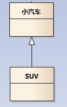

#看懂UML類圖和時序圖
這裡不會將UML的各種元素都提到，我只想講講類圖中各個類之間的關係；
能看懂類圖中各個類之間的線條、箭頭代表什麼意思後，也就足夠應對
日常的工作和交流；
同時，我們應該能將類圖所表達的含義和最終的代碼對應起來；
有了這些知識，看後面章節的設計模式結構圖就沒有什麼問題了；

本章所有圖形使用Enterprise Architect 9.2來畫,所有示例詳見根目錄下的design_patterns.EAP

從一個示例開始
--------------------

請看以下這個類圖，類之間的關係是我們需要關注的：

- 車的類圖結構為<<abstract>>，表示車是一個抽象類；
- 它有兩個繼承類：小汽車和自行車；它們之間的關係為實現關係，使用帶空心箭頭的虛線表示；
- 小汽車為與SUV之間也是繼承關係，它們之間的關係為泛化關係，使用帶空心箭頭的實線表示；
- 小汽車與發動機之間是組合關係，使用帶實心箭頭的實線表示；
- 學生與班級之間是聚合關係，使用帶空心箭頭的實線表示；
- 學生與身份證之間為關聯關係，使用一根實線表示；
- 學生上學需要用到自行車，與自行車是一種依賴關係，使用帶箭頭的虛線表示；

下面我們將介紹這六種關係；

---

#類之間的關係
###泛化關係(generalization)
^^^^^^^^^^^^^^^^^^^^^^^^^^^^^^^^
類的繼承結構表現在UML中為：泛化(generalize)與實現(realize)：

繼承關係為 is-a的關係；兩個對象之間如果可以用 is-a 來表示，就是繼承關係：（..是..)

eg：自行車是車、貓是動物

泛化關係用一條帶空心箭頭的直接表示；如下圖表示（A繼承自B）；

eg：汽車在現實中有實現，可用汽車定義具體的對象；汽車與SUV之間為泛化關係；

注：最終代碼中，泛化關係表現為繼承非抽象類；

#實現關係(realize)
實現關係用一條帶空心箭頭的虛線表示；

eg："車"為一個抽象概念，在現實中並無法直接用來定義對象；只有指明具體的子類(汽車還是自行車)，才
可以用來定義對象（"車"這個類在C++中用抽象類表示，在JAVA中有接口這個概念，更容易理解）

注：最終代碼中，實現關係表現為繼承抽象類；

#聚合關係(aggregation)
聚合關係用一條帶空心菱形箭頭的直線表示，如下圖表示A聚合到B上，或者說B由A組成；

聚合關係用於表示實體對象之間的關係，表示整體由部分構成的語義；例如一個部門由多個員工組成；

與組合關係不同的是，整體和部分不是強依賴的，即使整體不存在了，部分仍然存在；例如，
部門撤銷了，人員不會消失，他們依然存在；

#組合關係(composition)
組合關係用一條帶實心菱形箭頭直線表示，如下圖表示A組成B，或者B由A組成；

與聚合關係一樣，組合關係同樣表示整體由部分構成的語義；比如公司由多個部門組成；

但組合關係是一種強依賴的特殊聚合關係，如果整體不存在了，則部分也不存在了；例如，
公司不存在了，部門也將不存在了；

#關聯關係(association)
關聯關係是用一條直線表示的；它描述不同類的對象之間的結構關係；它是一種靜態關係，
通常與運行狀態無關，一般由常識等因素決定的；它一般用來定義對象之間靜態的、天然的結構；
所以，關聯關係是一種“強關聯”的關係；

比如，乘車人和車票之間就是一種關聯關係；學生和學校就是一種關聯關係；

關聯關係默認不強調方向，表示對象間相互知道；如果特別強調方向，如下圖，表示A知道B，但
B不知道A；

注：在最終代碼中，關聯對象通常是以成員變量的形式實現的；

#依賴關係(dependency)
依賴關係是用一套帶箭頭的虛線表示的；如下圖表示A依賴於B；他描述一個對象在運行期間會用到另一個對象的關係；

與關聯關係不同的是，它是一種臨時性的關係，通常在運行期間產生，並且隨著運行時的變化；
依賴關係也可能發生變化；

顯然，依賴也有方向，雙向依賴是一種非常糟糕的結構，我們總是應該保持單向依賴，杜絕雙向依賴的產生；

注：在最終代碼中，依賴關係體現為類構造方法及類方法的傳入參數，箭頭的指向為調用關係；依賴關係處理臨時知道對方外，還是“使用”對方的方法和屬性；

#時序圖
--------------------
為了展示對象之間的交互細節，後續對設計模式解析的章節，都會用到時序圖；

時序圖（Sequence Diagram）是顯示對象之間交互的圖，這些對象是按時間順序排列的。時序圖中顯示的是參與交互的對象及其對象之間消息交互的順序。

時序圖包括的建模元素主要有：對象（Actor）、生命線（Lifeline）、控制焦點（Focus of control）、消息（Message）等等。

關於時序圖，以下這篇文章將概念介紹的比較詳細；更多實例應用，參加後續章節模式中的時序圖；

http://smartlife.blog.51cto.com/1146871/284874

#附錄
在EA中定義一個抽象類（其版型為《abstract》)

