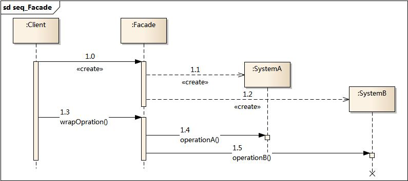

.. _facade:

外觀模式
====================

模式動機
--------------------

模式定義
--------------------
外觀模式(Facade Pattern)：外部與一個子系統的通信必須通過一個統一的外觀對象進行，為子系統中的一組接口提供一個一致的界面，外觀模式定義了一個高層接口，這個接口使得這一子系統更加容易使用。外觀模式又稱為門面模式，它是一種對象結構型模式。

模式結構
--------------------
外觀模式包含如下角色：

- Facade: 外觀角色
- SubSystem:子系統角色

時序圖
--------------------

代碼分析
--------------------

   :language: cpp
   :linenos:
   :lines: 1-
   :emphasize-lines: 7-8

   :language: cpp
   :linenos:
   :lines: 1-

   :language: cpp
   :linenos:
   :lines: 1-
   :emphasize-lines: 25-29

運行結果：

模式分析
--------------------
根據“單一職責原則”，在軟件中將一個系統劃分為若干個子系統有利於降低整個系統的複雜性，一個常見的設計目標是使子系統間的通信和相互依賴關係達到最小，而達到該目標的途徑之一就是引入一個外觀對象，它為子系統的訪問提供了一個簡單而單一的入口。
-外觀模式也是“迪米特法則”的體現，通過引入一個新的外觀類可以降低原有系統的複雜度，同時降低客戶類與子系統類的耦合度。
- 外觀模式要求一個子系統的外部與其內部的通信通過一個統一的外觀對象進行，外觀類將客戶端與子系統的內部複雜性分隔開，使得客戶端只需要與外觀對象打交道，而不需要與子系統內部的很多對象打交道。
-外觀模式的目的在於降低系統的複雜程度。
-外觀模式從很大程度上提高了客戶端使用的便捷性，使得客戶端無須關心子系統的工作細節，通過外觀角色即可調用相關功能。

實例
--------------------

優點
--------------------
外觀模式的優點

- 對客戶屏蔽子系統組件，減少了客戶處理的對象數目並使得子系統使用起來更加容易。通過引入外觀模式，客戶代碼將變得很簡單，與之關聯的對象也很少。
- 實現了子系統與客戶之間的鬆耦合關係，這使得子系統的組件變化不會影響到調用它的客戶類，只需要調整外觀類即可。
- 降低了大型軟件系統中的編譯依賴性，並簡化了系統在不同平臺之間的移植過程，因為編譯一個子系統一般不需要編譯所有其他的子系統。一個子系統的修改對其他子系統沒有任何影響，而且子系統內部變化也不會影響到外觀對象。
- 只是提供了一個訪問子系統的統一入口，並不影響用戶直接使用子系統類。

缺點
--------------------
外觀模式的缺點

- 不能很好地限制客戶使用子系統類，如果對客戶訪問子系統類做太多的限制則減少了可變性和靈活性。
- 在不引入抽象外觀類的情況下，增加新的子系統可能需要修改外觀類或客戶端的源代碼，違背了“開閉原則”。

適用環境
--------------------
在以下情況下可以使用外觀模式：

- 當要為一個複雜子系統提供一個簡單接口時可以使用外觀模式。該接口可以滿足大多數用戶的需求，而且用戶也可以越過外觀類直接訪問子系統。
- 客戶程序與多個子系統之間存在很大的依賴性。引入外觀類將子系統與客戶以及其他子系統解耦，可以提高子系統的獨立性和可移植性。
- 在層次化結構中，可以使用外觀模式定義系統中每一層的入口，層與層之間不直接產生聯繫，而通過外觀類建立聯繫，降低層之間的耦合度。

模式應用
--------------------

模式擴展
--------------------
一個系統有多個外觀類
    在外觀模式中，通常只需要一個外觀類，並且此外觀類只有一個實例，換言之它是一個單例類。在很多情況下為了節約系統資源，一般將外觀類設計為單例類。當然這並不意味著在整個系統裡只能有一個外觀類，在一個系統中可以設計多個外觀類，每個外觀類都負責和一些特定的子系統交互，向用戶提供相應的業務功能。

不要試圖通過外觀類為子系統增加新行為
    不要通過繼承一個外觀類在子系統中加入新的行為，這種做法是錯誤的。外觀模式的用意是為子系統提供一個集中化和簡化的溝通渠道，而不是向子系統加入新的行為，新的行為的增加應該通過修改原有子系統類或增加新的子系統類來實現，不能通過外觀類來實現。

外觀模式與迪米特法則
    外觀模式創造出一個外觀對象，將客戶端所涉及的屬於一個子系統的協作夥伴的數量減到最少，使得客戶端與子系統內部的對象的相互作用被外觀對象所取代。外觀類充當了客戶類與子系統類之間的“第三者”，降低了客戶類與子系統類之間的耦合度，外觀模式就是實現代碼重構以便達到“迪米特法則”要求的一個強有力的武器。

抽象外觀類的引入
    外觀模式最大的缺點在於違背了“開閉原則”，當增加新的子系統或者移除子系統時需要修改外觀類，可以通過引入抽象外觀類在一定程度上解決該問題，客戶端針對抽象外觀類進行編程。對於新的業務需求，不修改原有外觀類，而對應增加一個新的具體外觀類，由新的具體外觀類來關聯新的子系統對象，同時通過修改配置文件來達到不修改源代碼並更換外觀類的目的。

總結
--------------------
- 在外觀模式中，外部與一個子系統的通信必須通過一個統一的外觀對象進行，為子系統中的一組接口提供一個一致的界面，外觀模式定義了一個高層接口，這個接口使得這一子系統更加容易使用。外觀模式又稱為門面模式，它是一種對象結構型模式。
- 外觀模式包含兩個角色：外觀角色是在客戶端直接調用的角色，在外觀角色中可以知道相關的(一個或者多個)子系統的功能和責任，它將所有從客戶端發來的請求委派到相應的子系統去，傳遞給相應的子系統對象處理；在軟件系統中可以同時有一個或者多個子系統角色，每一個子系統可以不是一個單獨的類，而是一個類的集合，它實現子系統的功能。
- 外觀模式要求一個子系統的外部與其內部的通信通過一個統一的外觀對象進行，外觀類將客戶端與子系統的內部複雜性分隔開，使得客戶端只需要與外觀對象打交道，而不需要與子系統內部的很多對象打交道。
- 外觀模式主要優點在於對客戶屏蔽子系統組件，減少了客戶處理的對象數目並使得子系統使用起來更加容易，它實現了子系統與客戶之間的鬆耦合關係，並降低了大型軟件系統中的編譯依賴性，簡化了系統在不同平臺之間的移植過程；其缺點在於不能很好地限制客戶使用子系統類，而且在不引入抽象外觀類的情況下，增加新的子系統可能需要修改外觀類或客戶端的源代碼，違背了“開閉原則”。
- 外觀模式適用情況包括：要為一個複雜子系統提供一個簡單接口；客戶程序與多個子系統之間存在很大的依賴性；在層次化結構中，需要定義系統中每一層的入口，使得層與層之間不直接產生聯繫。
