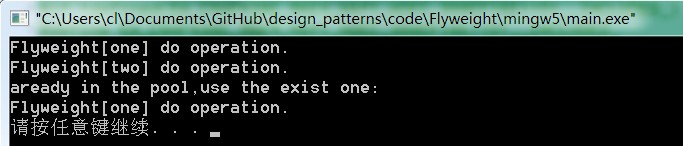

#享元模式

#模式動機
面向對象技術可以很好地解決一些靈活性或可擴展性問題，但在很多情況下需要在系統中增加類和對象的個數。當對象數量太多時，將導致運行代價過高，帶來性能下降等問題。

- 享元模式正是為解決這一類問題而誕生的。享元模式通過共享技術實現相同或相似對象的重用。
- 在享元模式中可以共享的相同內容稱為內部狀態(IntrinsicState)，而那些需要外部環境來設置的不能共享的內容稱為外部狀態(Extrinsic State)，由於區分了內部狀態和外部狀態，因此可以通過設置不同的外部狀態使得相同的對象可以具有一些不同的特徵，而相同的內部狀態是可以共享的。
- 在享元模式中通常會出現工廠模式，需要創建一個享元工廠來負責維護一個享元池(Flyweight Pool)用於存儲具有相同內部狀態的享元對象。
- 在享元模式中共享的是享元對象的內部狀態，外部狀態需要通過環境來設置。在實際使用中，能夠共享的內部狀態是有限的，因此享元對象一般都設計為較小的對象，它所包含的內部狀態較少，這種對象也稱為細粒度對象。享元模式的目的就是使用共享技術來實現大量細粒度對象的複用。

#模式定義
享元模式(Flyweight Pattern)：運用共享技術有效地支持大量細粒度對象的複用。系統只使用少量的對象，而這些對象都很相似，狀態變化很小，可以實現對象的多次複用。由於享元模式要求能夠共享的對象必須是細粒度對象，因此它又稱為輕量級模式，它是一種對象結構型模式。

#模式結構
享元模式包含如下角色：

- Flyweight: 抽象享元類
- ConcreteFlyweight: 具體享元類
- UnsharedConcreteFlyweight: 非共享具體享元類
- FlyweightFactory: 享元工廠類


#時序圖


#代碼分析
```cpp
#include <iostream>
#include "ConcreteFlyweight.h"
#include "FlyweightFactory.h"
#include "Flyweight.h"
using namespace std;

int main(int argc, char* argv[])
{
    FlyweightFactory factory;
    Flyweight* fw = factory.getFlyweight("one");
    fw->operation();

    Flyweight* fw2 = factory.getFlyweight("two");
    fw2->operation();
    //aready exist in pool
    Flyweight* fw3 = factory.getFlyweight("one");
    fw3->operation();
    return 0;
}
```
```cpp
///////////////////////////////////////////////////////////
//  FlyweightFactory.cpp
//  Implementation of the Class FlyweightFactory
//  Created on:      06-十月-2014 20:10:42
//  Original author: colin
///////////////////////////////////////////////////////////

#include "FlyweightFactory.h"
#include "ConcreteFlyweight.h"
#include <iostream>
using namespace std;

FlyweightFactory::FlyweightFactory()
{

}


FlyweightFactory::~FlyweightFactory()
{

}

Flyweight* FlyweightFactory::getFlyweight(string str)
{
    map<string, Flyweight*>::iterator itr = m_mpFlyweight.find(str);

    if (itr == m_mpFlyweight.end()) {
        Flyweight* fw = new ConcreteFlyweight(str);
        m_mpFlyweight.insert(make_pair(str, fw));
        return fw;
    } else {
        cout << "aready in the pool,use the exist one:" << endl;
        return itr->second;
    }
}
```
```cpp
///////////////////////////////////////////////////////////
//  FlyweightFactory.h
//  Implementation of the Class FlyweightFactory
//  Created on:      06-十月-2014 20:10:42
//  Original author: colin
///////////////////////////////////////////////////////////

#if !defined(EA_C0370E5F_AC7A_4f98_8E8B_CAA37A1EE7EA__INCLUDED_)
#define EA_C0370E5F_AC7A_4f98_8E8B_CAA37A1EE7EA__INCLUDED_

#include "Flyweight.h"
#include <map>
#include <string>
using namespace std;

class FlyweightFactory
{

public:
    FlyweightFactory();
    virtual ~FlyweightFactory();

    Flyweight*  getFlyweight(string str);

private:
    map<string, Flyweight*> m_mpFlyweight;

};
#endif // !defined(EA_C0370E5F_AC7A_4f98_8E8B_CAA37A1EE7EA__INCLUDED_)
```

```cpp
///////////////////////////////////////////////////////////
//  ConcreteFlyweight.cpp
//  Implementation of the Class ConcreteFlyweight
//  Created on:      06-十月-2014 20:10:42
//  Original author: colin
///////////////////////////////////////////////////////////

#include "ConcreteFlyweight.h"
#include <iostream>
using namespace std;


ConcreteFlyweight::ConcreteFlyweight(string str)
{
    intrinsicState = str;
}

ConcreteFlyweight::~ConcreteFlyweight()
{

}

void ConcreteFlyweight::operation()
{
    cout << "Flyweight[" << intrinsicState << "] do operation." << endl;
}
```

#運行結果：



#模式分析
享元模式是一個考慮系統性能的設計模式，通過使用享元模式可以節約內存空間，提高系統的性能。

享元模式的核心在於享元工廠類，享元工廠類的作用在於提供一個用於存儲享元對象的享元池，用戶需要對象時，首先從享元池中獲取，如果享元池中不存在，則創建一個新的享元對象返回給用戶，並在享元池中保存該新增對象。

享元模式以共享的方式高效地支持大量的細粒度對象，享元對象能做到共享的關鍵是區分內部狀態(Internal State)和外部狀態(External State)。

- 內部狀態是存儲在享元對象內部並且不會隨環境改變而改變的狀態，因此內部狀態可以共享。
- 外部狀態是隨環境改變而改變的、不可以共享的狀態。享元對象的外部狀態必須由客戶端保存，並在享元對象被創建之後，在需要使用的時候再傳入到享元對象內部。一個外部狀態與另一個外部狀態之間是相互獨立的。

#實例

#優點
享元模式的優點

- 享元模式的優點在於它可以極大減少內存中對象的數量，使得相同對象或相似對象在內存中只保存一份。
- 享元模式的外部狀態相對獨立，而且不會影響其內部狀態，從而使得享元對象可以在不同的環境中被共享。

#缺點
享元模式的缺點

- 享元模式使得系統更加複雜，需要分離出內部狀態和外部狀態，這使得程序的邏輯複雜化。
- 為了使對象可以共享，享元模式需要將享元對象的狀態外部化，而讀取外部狀態使得運行時間變長。

#適用環境
在以下情況下可以使用享元模式：

- 一個系統有大量相同或者相似的對象，由於這類對象的大量使用，造成內存的大量耗費。
- 對象的大部分狀態都可以外部化，可以將這些外部狀態傳入對象中。
- 使用享元模式需要維護一個存儲享元對象的享元池，而這需要耗費資源，因此，應當在多次重複使用享元對象時才值得使用享元模式。


#模式應用
享元模式在編輯器軟件中大量使用，如在一個文檔中多次出現相同的圖片，則只需要創建一個圖片對象，通過在應用程序中設置該圖片出現的位置，可以實現該圖片在不同地方多次重複顯示。

#模式擴展
單純享元模式和複合享元模式

- 單純享元模式：在單純享元模式中，所有的享元對象都是可以共享的，即所有抽象享元類的子類都可共享，不存在非共享具體享元類。
- 複合享元模式：將一些單純享元使用組合模式加以組合，可以形成複合享元對象，這樣的複合享元對象本身不能共享，但是它們可以分解成單純享元對象，而後者則可以共享。

享元模式與其他模式的聯用

- 在享元模式的享元工廠類中通常提供一個靜態的工廠方法用於返回享元對象，使用簡單工廠模式來生成享元對象。
- 在一個系統中，通常只有唯一一個享元工廠，因此享元工廠類可以使用單例模式進行設計。
- 享元模式可以結合組合模式形成複合享元模式，統一對享元對象設置外部狀態。


#總結
- 享元模式運用共享技術有效地支持大量細粒度對象的複用。系統只使用少量的對象，而這些對象都很相似，狀態變化很小，可以實現對象的多次複用，它是一種對象結構型模式。
- 享元模式包含四個角色：抽象享元類聲明一個接口，通過它可以接受並作用於外部狀態；具體享元類實現了抽象享元接口，其實例稱為享元對象；非共享具體享元是不能被共享的抽象享元類的子類；享元工廠類用於創建並管理享元對象，它針對抽象享元類編程，將各種類型的具體享元對象存儲在一個享元池中。
- 享元模式以共享的方式高效地支持大量的細粒度對象，享元對象能做到共享的關鍵是區分內部狀態和外部狀態。其中內部狀態是存儲在享元對象內部並且不會隨環境改變而改變的狀態，因此內部狀態可以共享；外部狀態是隨環境改變而改變的、不可以共享的狀態。
- 享元模式主要優點在於它可以極大減少內存中對象的數量，使得相同對象或相似對象在內存中只保存一份；其缺點是使得系統更加複雜，並且需要將享元對象的狀態外部化，而讀取外部狀態使得運行時間變長。
- 享元模式適用情況包括：一個系統有大量相同或者相似的對象，由於這類對象的大量使用，造成內存的大量耗費；對象的大部分狀態都可以外部化，可以將這些外部狀態傳入對象中；多次重複使用享元對象。
