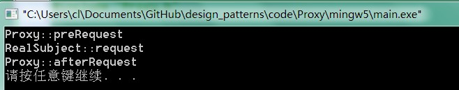

.. _proxy:

代理模式
====================

模式動機
--------------------
在某些情況下，一個客戶不想或者不能直接引用一個對 象，此時可以通過一個稱之為“代理”的第三者來實現 間接引用。代理對象可以在客戶端和目標對象之間起到 中介的作用，並且可以通過代理對象去掉客戶不能看到 的內容和服務或者添加客戶需要的額外服務。

通過引入一個新的對象（如小圖片和遠程代理 對象）來實現對真實對象的操作或者將新的對 象作為真實對象的一個替身，這種實現機制即 為代理模式，通過引入代理對象來間接訪問一 個對象，這就是代理模式的模式動機。

模式定義
--------------------
代理模式(Proxy Pattern) ：給某一個對象提供一個代 理，並由代理對象控制對原對象的引用。代理模式的英 文叫做Proxy或Surrogate，它是一種對象結構型模式。

模式結構
--------------------
代理模式包含如下角色：

- Subject: 抽象主題角色
- Proxy: 代理主題角色
- RealSubject: 真實主題角色

時序圖
--------------------

代碼分析
--------------------

   :language: cpp
   :linenos:
   :lines: 1-

   :language: cpp
   :linenos:
   :lines: 1-
   :emphasize-lines: 24-26

   :language: cpp
   :linenos:
   :lines: 1-
   :emphasize-lines: 14-16,33-37

運行結果：

模式分析
--------------------

實例
--------------------

優點
--------------------
代理模式的優點

- 代理模式能夠協調調用者和被調用者，在一定程度上降低了系 統的耦合度。
- 遠程代理使得客戶端可以訪問在遠程機器上的對象，遠程機器 可能具有更好的計算性能與處理速度，可以快速響應並處理客戶端請求。
- 虛擬代理通過使用一個小對象來代表一個大對象，可以減少系 統資源的消耗，對系統進行優化並提高運行速度。
- 保護代理可以控制對真實對象的使用權限。

缺點
--------------------
代理模式的缺點

- 由於在客戶端和真實主題之間增加了代理對象，因此 有些類型的代理模式可能會造成請求的處理速度變慢。
- 實現代理模式需要額外的工作，有些代理模式的實現 非常複雜。

適用環境
--------------------
根據代理模式的使用目的，常見的代理模式有以下幾種類型：

- 遠程(Remote)代理：為一個位於不同的地址空間的對象提供一個本地 的代理對象，這個不同的地址空間可以是在同一臺主機中，也可是在 另一臺主機中，遠程代理又叫做大使(Ambassador)。
- 虛擬(Virtual)代理：如果需要創建一個資源消耗較大的對象，先創建一個消耗相對較小的對象來表示，真實對象只在需要時才會被真正創建。
- Copy-on-Write代理：它是虛擬代理的一種，把複製（克隆）操作延遲 到只有在客戶端真正需要時才執行。一般來說，對象的深克隆是一個 開銷較大的操作，Copy-on-Write代理可以讓這個操作延遲，只有對象被用到的時候才被克隆。
- 保護(Protect or Access)代理：控制對一個對象的訪問，可以給不同的用戶提供不同級別的使用權限。
- 緩衝(Cache)代理：為某一個目標操作的結果提供臨時的存儲空間，以便多個客戶端可以共享這些結果。
- 防火牆(Firewall)代理：保護目標不讓惡意用戶接近。
- 同步化(Synchronization)代理：使幾個用戶能夠同時使用一個對象而沒有衝突。
- 智能引用(Smart Reference)代理：當一個對象被引用時，提供一些額外的操作，如將此對象被調用的次數記錄下來等。

模式應用
--------------------
EJB、Web Service等分佈式技術都是代理模式的應用。在EJB中使用了RMI機制，遠程服務器中的企業級Bean在本地有一個樁代理，客戶端通過樁來調用遠程對象中定義的方法，而無須直接與遠程對象交互。在EJB的使用中需要提供一個公共的接口，客戶端針對該接口進行編程，無須知道樁以及遠程EJB的實現細節。

模式擴展
--------------------
幾種常用的代理模式

- 圖片代理：一個很常見的代理模式的應用實例就是對大圖瀏覽的控制。
- 用戶通過瀏覽器訪問網頁時先不加載真實的大圖，而是通過代理對象的方法來進行處理，在代理對象的方法中，先使用一個線程向客戶端瀏覽器加載一個小圖片，然後在後臺使用另一個線程來調用大圖片的加載方法將大圖片加載到客戶端。當需要瀏覽大圖片時，再將大圖片在新網頁中顯示。如果用戶在瀏覽大圖時加載工作還沒有完成，可以再啟動一個線程來顯示相應的提示信息。通過代理技術結合多線程編程將真實圖片的加載放到後臺來操作，不影響前臺圖片的瀏覽。
- 遠程代理：遠程代理可以將網絡的細節隱藏起來，使得客戶端不必考慮網絡的存在。客戶完全可以認為被代理的遠程業務對象是局域的而不是遠程的，而遠程代理對象承擔了大部分的網絡通信工作。
- 虛擬代理：當一個對象的加載十分耗費資源的時候，虛擬代理的優勢就非常明顯地體現出來了。虛擬代理模式是一種內存節省技術，那些佔用大量內存或處理複雜的對象將推遲到使用它的時候才創建。
-在應用程序啟動的時候，可以用代理對象代替真實對象初始化，節省了內存的佔用，並大大加速了系統的啟動時間。

動態代理

- 動態代理是一種較為高級的代理模式，它的典型應用就是Spring AOP。
- 在傳統的代理模式中，客戶端通過Proxy調用RealSubject類的request()方法，同時還在代理類中封裝了其他方法(如preRequest()和postRequest())，可以處理一些其他問題。
- 如果按照這種方法使用代理模式，那麼真實主題角色必須是事先已經存在的，並將其作為代理對象的內部成員屬性。如果一個真實主題角色必須對應一個代理主題角色，這將導致系統中的類個數急劇增加，因此需要想辦法減少系統中類的個數，此外，如何在事先不知道真實主題角色的情況下使用代理主題角色，這都是動態代理需要解決的問題。

總結
--------------------
在代理模式中，要求給某一個對象提供一個代理，並由代理對象控制對原對象的引用。代理模式的英文叫做Proxy或Surrogate，它是一種對象結構型模式。
- 代理模式包含三個角色：抽象主題角色聲明瞭真實主題和代理主題的共同接口；代理主題角色內部包含對真實主題的引用，從而可以在任何時候操作真實主題對象；真實主題角色定義了代理角色所代表的真實對象，在真實主題角色中實現了真實的業務操作，客戶端可以通過代理主題角色間接調用真實主題角色中定義的方法。
- 代理模式的優點在於能夠協調調用者和被調用者，在一定程度上降低了系統的耦合度；其缺點在於由於在客戶端和真實主題之間增加了代理對象，因此有些類型的代理模式可能會造成請求的處理速度變慢，並且實現代理模式需要額外的工作，有些代理模式的實現非常複雜。遠程代理為一個位於不同的地址空間的對象提供一個本地的代表對象，它使得客戶端可以訪問在遠程機器上的對象，遠程機器可能具有更好的計算性能與處理速度，可以快速響應並處理客戶端請求。- 如果需要創建一個資源消耗較大的對象，先創建一個消耗相對較小的對象來表示，真實對象只在需要時才會被真正創建，這個小對象稱為虛擬代理。虛擬代理通過使用一個小對象來代表一個大對象，可以減少系統資源的消耗，對系統進行優化並提高運行速度。
- 保護代理可以控制對一個對象的訪問，可以給不同的用戶提供不同級別的使用權限。

